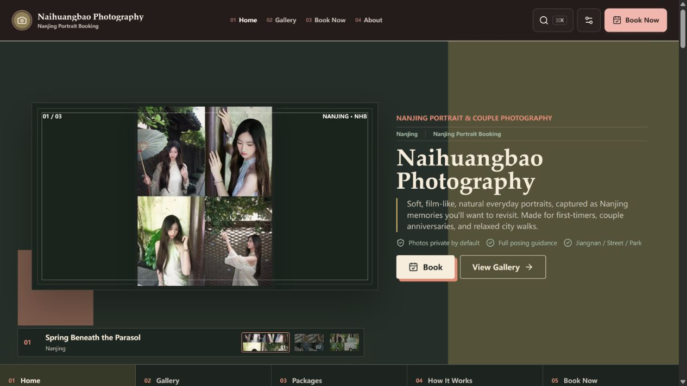

<!-- Project artwork created for this repository. -->
<p align="center">
  
</p>

<h1 align="center">Naihuangbao Photography</h1>

<p align="center">
  
</p>

**A portrait-photography website experiment, with galleries, booking flows, and a creative playground.**

<p align="center"><a href="#explore">Explore</a> &nbsp; · &nbsp; <a href="#run-locally">Run locally</a> &nbsp; · &nbsp; <a href="#work-on-the-project">Work on the project</a></p>

[Visit the site](https://shoot.custard.top) · [Architecture](docs/ARCHITECTURE.md) · [Contributing](CONTRIBUTING.md)


<p align="center">
  
</p>

<sub>Live homepage, captured on 2026-10-10.</sub>


## Explore

- **Main site:** photography portfolios, package descriptions, and booking flows.
- **`/practice`:** archive, story-building, and browser editing experiments.
- **`/law`:** a separate study area with interactive lessons, quizzes, and local progress.

This is a personal product and engineering practice project. Its pages are not a promise of a commercial photography service. Experimental tools are kept separate from the main site.

## Run locally

Use the Node.js version in `.node-version` (**26**) and the npm version in `package.json`.

```bash
npm ci
npm run dev
```

The frontend runs locally. Booking and other backend features need Cloudflare bindings and local secrets; see the [configuration reference](docs/MAINTENANCE.md).

<details>
<summary>Backend and deployment secrets</summary>

Local secrets belong in ignored `.dev.vars`. The deployed Pages project requires `ADMIN_PASSWORD`, `AUTH_SECRET`, and `RATE_LIMIT_SECRET`. Set them through Wrangler's interactive prompts:

```bash
npx wrangler pages secret put ADMIN_PASSWORD --project-name naihuangbao-photography
npx wrangler pages secret put AUTH_SECRET --project-name naihuangbao-photography
npx wrangler pages secret put RATE_LIMIT_SECRET --project-name naihuangbao-photography
```

Password-reset email also needs `RESEND_API_KEY` and `RESET_EMAIL_FROM`. Never put secret values in source files.

</details>

## Work on the project

```bash
npm run verify
```

Before a release, use `npm run verify:release` to include the browser tests.

| Area | Location |
| --- | --- |
| Pages and shared features | `src/pages/`, `src/features/` |
| Editable stories and archive content | `content/` |
| Backend | `functions/` |
| Build and content tools | `scripts/` |

Edit source content, then regenerate its manifests; do not hand-edit generated JSON. Detailed content, database, and release steps are in the [maintenance reference](docs/MAINTENANCE.md).

Original code is available for noncommercial use under [PolyForm Noncommercial 1.0.0](LICENSE). See [license scope and third-party assets](docs/LICENSE_SCOPE.md).
